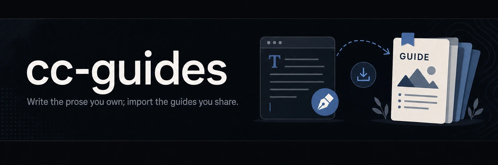

# 

**Write the prose you own; import the guides you share.** cc-guides composes `AGENTS.md`, `CLAUDE.md`, and shell scripts from local fragments and shared guides pulled in by reference, and `cc-guides check` catches drift the moment an artifact diverges, surfacing it in CI as a non-blocking warning that the daily re-render heals.

[](https://github.com/yasyf/cc-guides/releases)
[](https://github.com/yasyf/cc-guides/actions/workflows/ci.yml)
[](https://github.com/yasyf/cc-guides/blob/main/LICENSE)

## Get started

```bash
brew install yasyf/tap/cc-guides
```

A repo describes each generated file with a `.claude/fragments/<target>/` directory: a `layout.toml` that composes local `*.fragment.*` prose with imports of shared guides, plus the local pieces. Each imported alias names its source in a `[sources.<alias>]` table. `render` fetches each import at a pinned commit, writes the target with a version-free GENERATED marker, and records every pin in a lock file:

```console
$ cat .claude/fragments/AGENTS.md/intro.fragment.md
# Acme

House rules for agents.

$ cat .claude/fragments/AGENTS.md/layout.toml
fragments = [
  "intro",
  "cc-skills:ccx",
]

[sources.cc-skills]
source = "github:yasyf/cc-skills@main"

$ cc-guides render
rendered .claude/fragments/AGENTS.md -> AGENTS.md

$ head -6 AGENTS.md
<!-- GENERATED by cc-guides from .claude/fragments/AGENTS.md/ — do not edit; edit the fragments and run 'cc-guides render'. -->
# Acme

House rules for agents.

## Compact Context (ccx)
```

`intro` is your prose; `cc-skills:ccx` arrives verbatim from the shared guides in [cc-skills](https://github.com/yasyf/cc-skills), identical across every repo that imports it. Change the shared guide once and every repo re-renders. `render` also writes `.claude/fragments/cc-guides.lock`, which pins every source to the exact commit the artifacts were built against; `check` and the CI action read it, so a new cc-guides release never reddens a repo that has not re-rendered.

Driving with an agent? Paste this:

```text
Install cc-guides (`brew install yasyf/tap/cc-guides`). Give AGENTS.md a
.claude/fragments/AGENTS.md/ layout: a layout.toml composing my local
*.fragment.md prose with the shared guides I import, then run `cc-guides render`
(it writes AGENTS.md and .claude/fragments/cc-guides.lock) and wire
`cc-guides check` into CI. Reference: `cc-guides --help`.
```

---

## Use cases

### Catch drift in CI

An artifact edited by hand, or left stale after a shared guide changed, should surface and heal without blocking unrelated work. `check` re-composes each target in memory — pinned to the commits the lock records — and byte-compares against disk:

```console
$ cc-guides check
OK	AGENTS.md

$ echo "agent slop" >> AGENTS.md
$ cc-guides check
STALE	AGENTS.md
$ echo "exit: $?"
exit: 1
```

`OK`, `STALE`, and `MISSING` go to stdout as TSV; exit 1 signals drift, 2 an invalid layout. In GitHub Actions, one step checks every artifact:

```yaml
- uses: actions/checkout@v7
- uses: yasyf/cc-guides@action-v1
```

The action installs the exact cc-guides version the lock records, so a new release never reddens a repo that has not re-rendered yet. Drift comes back as a non-blocking warning that the daily re-render heals, while a broken setup with a missing, dev, or local lock still fails the run.

### Keep one repo's spin on a shared guide

A repo needs its own version of a guide the rest of the fleet shares. Compose a local fragment in the slot where the import would sit — no import, no shadowing:

```toml
fragments = [
  "intro",
  "ccx",          # local ccx.fragment.md, not cc-skills:ccx
]
```

`render` reads `ccx.fragment.md` from the artifact dir instead of fetching the shared guide, and a layout that imports nothing locks no sources at all.

### Adopt the lock on an older repo

A repo rendered by an older cc-guides (`0.1.12` or earlier) carries a per-artifact banner and no `.claude/fragments/cc-guides.lock`. `check` and the CI action are lock-only, so adopt the lock with one render against the current binary — it rewrites each artifact with a version-free marker and writes the lock:

```console
$ cc-guides render
rendered .claude/fragments/AGENTS.md -> AGENTS.md

$ git add .claude/fragments/cc-guides.lock AGENTS.md
```

Commit the lock alongside the artifacts. From then on a new cc-guides release re-renders byte-identically, so the lock never needs a manual bump.

## Composition

An artifact dir is any directory under `.claude/fragments/` that holds a `layout.toml`, and its path below that root is the target it renders. `.claude/fragments/AGENTS.md/` renders `AGENTS.md`; a nested path renders a nested target. The kind — Markdown, shell comment style, JSON, YAML, or TOML — comes from the target extension. A JSON target deep-merges its pieces (arrays concatenate, objects merge) and carries no marker; the lock is its only drift record. A YAML target concatenates its pieces like Markdown (never a semantic merge, so load-bearing comments survive) and carries a `#`-comment marker. A TOML target concatenates the same way — fragments are disjoint table sets, so comments and the marker survive — and re-validates the composed output at render, catching an authoring slip like the same table defined in two fragments before it ever reaches a consumer.

`layout.toml` is an ordered, heterogeneous `fragments` array. The array comes first, before any `[sources.*]` table: a top-level key written after a table header nests inside that table, and the binary hard-errors on that shape instead of composing empty.

```toml
fragments = [
  "agents-md",                       # local: agents-md.fragment.md in this dir
  "cc-skills:ccx",                   # import: the ccx guide from cc-skills
  { use = "cc-skills:install-binary-latest", args = { binary = "slop-cop", plugin = "slop-cop", repo = "yasyf/slop-cop", brew = "yasyf/tap/slop-cop" } },
]

[sources.cc-skills]                  # required: every imported alias declares its source
source = "github:yasyf/cc-skills@main"
```

A string entry is a local `<name>.fragment.<ext>` or an `alias:name` import; an inline table adds `args` that fill `{{token}}` placeholders in the imported body. Every imported alias needs its own `[sources.<alias>]` table — there is no baked-in default. A source spec takes one of two forms: the manifest form `github:<owner>/<repo>[@<ref>]`, which follows the target repo's `cc-guides.toml` to its guides dir, or the explicit-path form `github:<owner>/<repo>//<path>[@<ref>]`, which points straight at a subtree. Pieces join with one blank line between them, LF only, one trailing newline. Prose is never token-substituted, so `${{ github.sha }}` and `{{VAR}}` survive verbatim.

## Commands

One invocation per surface; run `cc-guides <command> --help` for the full flag list.

| Command | What it does |
|---|---|
| `render [paths…]` | Compose each artifact dir to its target and write the lock. No paths: discover every layout under the repo. |
| `check [paths…]` | Re-compose in memory, pinned to the lock's commits, and byte-compare. TSV `OK`/`STALE`/`MISSING`; exit 1 on drift, 2 on invalid input. |
| `lint <dir>` | Check a shared-guides directory for purity: LF, one trailing newline, kind, shell shebang. |
| `list` | List each artifact dir and the fragments it composes. |
| `cat <ref>` | Print a fragment body: an `alias:name` import or a local piece by name. |

`--source alias=<spec>` overrides where an import resolves — a `github:` spec or a local directory for development. `--version` prints the cc-guides version, which `render` stamps into the lock.

## How it fits together

cc-guides ships two things: this binary and an importable GitHub Action. The content lives in its consumers — [cc-skills](https://github.com/yasyf/cc-skills) is the reference home for the shared guides, and each repo carries its own layouts. An import resolves to an immutable commit through `git ls-remote`, fetches that tree from codeload, and caches it under the user cache dir; every artifact in a run pins the same sha, recorded in `.claude/fragments/cc-guides.lock`. `check` reads those pins from the lock, so it reproduces an artifact offline once the cache is warm and never false-fails across binary versions. Build, test, and lint conventions live in [AGENTS.md](AGENTS.md).

```bash
task test   # go test -race ./...
task ci     # vet, lint, test, build
```

Licensed under [MIT](LICENSE).
